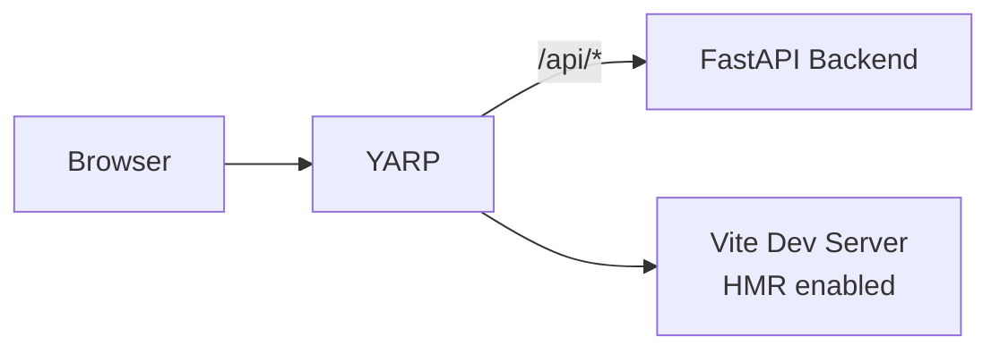
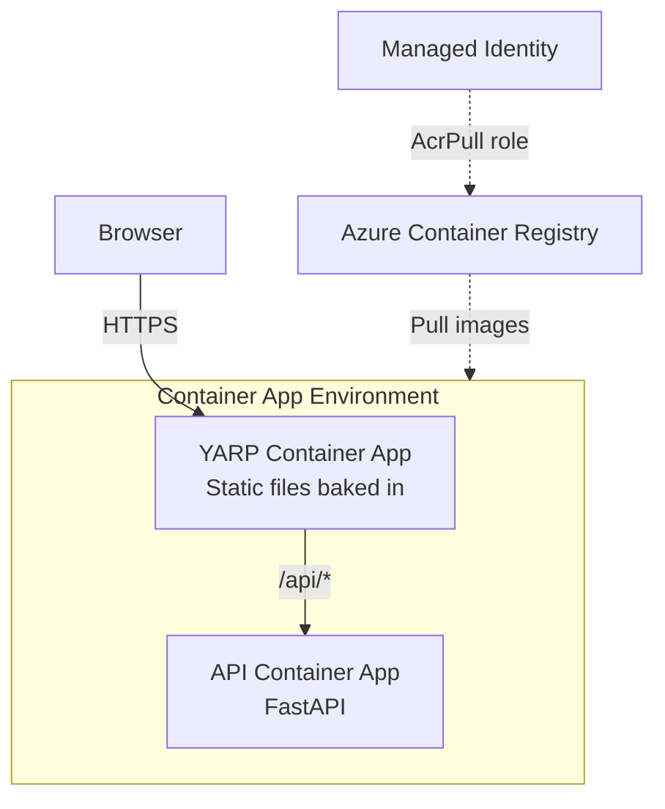

# Azure Container Apps with Terraform

Todo app with React frontend and Python FastAPI backend, deployed to Azure Container Apps using Terraform instead of Bicep.

## Architecture

**Run Mode:**



**Publish Mode (Azure Container Apps):**



## What This Demonstrates

- **AddTerraformAzureContainerAppEnvironment**: Terraform-based Azure infrastructure
- **PublishAsTerraformContainerApp**: Generate Container App modules from Aspire resources
- **Two-Stage Deployment**: Registry first, then environment + apps together
- **Inter-App References**: `module.api.http_endpoint` for service discovery
- **Customization Callbacks**: Add tags, modify settings via `PublishAsTerraformContainerApp`
- **EmmittJ.Terraform.Sdk**: C# → HCL code generation

## Running

```bash
aspire run
```

## Commands

```bash
aspire run      # Run locally with Vite HMR
aspire publish  # Generate Terraform without deploying
aspire deploy   # Full deployment to Azure
```

## Key Aspire Patterns

**Terraform Environment Setup** - Configure Azure infrastructure with fluent API:

```csharp
var subscriptionId = builder.AddParameter("azure-subscription-id");

builder.AddTerraformAzureContainerAppEnvironment("azure")
    .WithSubscriptionId(subscriptionId)
    .WithLocation("westus2")
    .WithBackend("local");
```

**YARP with Path Transform** - Strip `/api` prefix before forwarding to FastAPI:

```csharp
var api = builder.AddUvicornApp("api", "../api", "main:app")
    .WithHttpHealthCheck("/health");

var frontend = builder.AddViteApp("frontend", "../frontend")
    .WithReference(api);

builder.AddYarp("app")
    .WithConfiguration(c =>
    {
        c.AddRoute("api/{**catch-all}", api)
         .WithTransformPathRemovePrefix("/api"); // /api/todos → /todos

        if (builder.ExecutionContext.IsRunMode)
            c.AddRoute("{**catch-all}", frontend); // Run: proxy to Vite
    })
    .WithExternalHttpEndpoints()
    .PublishWithStaticFiles(frontend) // Publish: serve static files
    .PublishAsTerraformContainerApp((infra, app) =>
    {
        app.Tags ??= new();
        app.Tags["CustomTag"] = "MyValue";
    });
```

## Generated Terraform Structure

```
aspire-output/azure/
├── main.tf              # Environment: RG, LAW, MI, CAE + module calls
├── api/
│   └── main.tf          # API Container App module
└── app/
    └── main.tf          # YARP Container App module
```

**Root module includes:**

- `azurerm_resource_group`, `azurerm_log_analytics_workspace`
- `azurerm_user_assigned_identity` with AcrPull role
- `azurerm_container_app_environment`
- `module "api"` and `module "app"` with inter-module references

## Infrastructure Mapping

| Aspire (Bicep)                   | Terraform Equivalent                |
| -------------------------------- | ----------------------------------- |
| `ContainerAppManagedEnvironment` | `azurerm_container_app_environment` |
| `ContainerApp`                   | `azurerm_container_app`             |
| `ContainerRegistryService`       | `azurerm_container_registry`        |
| `OperationalInsightsWorkspace`   | `azurerm_log_analytics_workspace`   |
| `UserAssignedIdentity`           | `azurerm_user_assigned_identity`    |
| `uniqueString()`                 | `random_pet` + `random_string`      |

## Two-Stage Deployment

Images must exist in ACR before Container Apps can reference them:

1. **Stage 1: Registry** (separate state)

   - `{name}-registry-rg` with ACR
   - Outputs: `name`, `endpoint`

2. **Stage 2: Environment + Apps** (single `terraform apply`)
   - `{name}-aca-rg` with LAW, MI, CAE
   - Container App modules provisioned together
   - Inter-app refs via `module.api.http_endpoint`

## Container App Features

Generated `AzurermContainerApp` includes:

- User Assigned Identity for secure ACR pull
- HTTP ingress (external/internal, HTTP/2 support)
- Auto-scaling: 1-3 replicas, 100 concurrent requests
- Environment variables from Aspire annotations
- Custom tags: `ManagedBy: Aspire-Terraform`

## Clean Up

```bash
cd aspire-output/azure
terraform destroy
```
